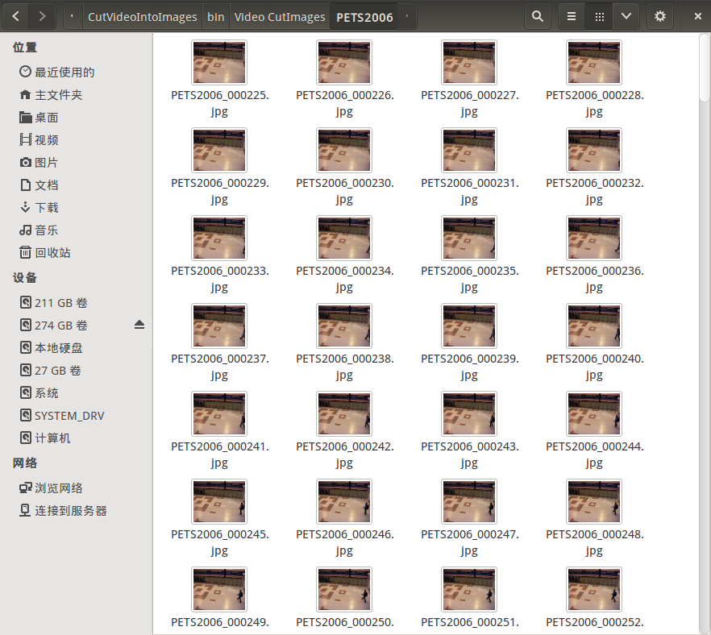

该仓库中内容是笔者基于 OpenCV 库的将视频切割为图像序列的控制台程序，输入一个装有若干视频文件路径的列表文件，以及视频文件个数，即可将这些视频逐帧切割生成到对应的文件夹中。

# 一、文件说明

- src：源代码所在路径；
- Test_Videos：测试使用视频，其中附带了两个简单的视频文件供测试说明；
- Images：ReadMe 文档中的截图路径；
- CMakeLists.txt：该工程的CMake文件；

# 二、工程使用说明
## 1. 笔者的工作环境

- 操作系统：Ubuntu 14.04 LTS
- 编译条件：
	- 已编译且安装OpenCV
	- 已安装CMake

关于Ubuntu 14.04下OpenCV的安装，笔者写的教程如下： 
[《CSDN 博客教学》](http://blog.csdn.net/ajianyingxiaoqinghan/article/details/62424132)
[《GitHub 博客教学》](https://github.com/upcAutoLang/Blog/issues/1)

## 2. 构建项目说明
进入终端，进入该项目 CutVideoIntoImages 的根目录，输入以下指令：
```shell
cmake ./
make
```
即可编译该工程。<br>
生成文件路径：**/CutVideoIntoImages/bin**<br>
生成库文件路径：**/CutVideoIntoImages/lib**<br>

## 3. 工程使用说明
设根目录为 CutVideoIntoImages，且已经按照上述过程成功的构建了项目，则可执行文件 CutVideoIntoImages 的位置应该在 /CutVideoIntoImages/bin 中。我们以提供的两个测试视频为例，测试视频放在根目录的 Test Video 路径中，该路径下的 video_list.txt 是一个视频文件列表。
此时我们打开终端，进入该项目根目录后，执行如下指令：
```shell
cd ./bin
./CutVideoIntoImages -info ../Test_Videos/video_list.txt -num 2
```
此时开始切割视频，并将图片保存在执行文件的路径下（即 /CutVideoIntoImages/bin 路径下）的 Video CutImages 路径中，每个视频文件的图片序列都保存在以视频文件命名的文件夹中。切割成的图像序列大致如下图所示：



