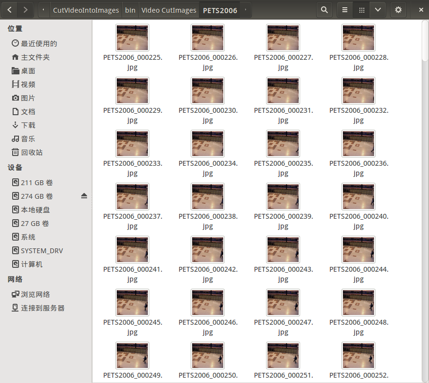

This repository is the C++ Source Code of a Console Program, which Cut Videos into Image Sequence and is based on OpenCV Library. In Terminal, we can **Input a List File which Includes a series of Videos' Path** and **the Number of these Videos**, then we will **Cut these videos frame by frame as Sequences of Images** which are Saved in Specified Folders **(These Folder's Name is same as the Videos' names)**.

# Files Introduction

- **src** - Source Code's Path
- **Test_Videos** - Videos for test (There are **2 Videos and a List File** in this folder for Test
- **Images** - Images for README.md
- **CMakeLists.txt** - Cmake File of this Project

# Tutorial for Using this Project
## 1. My Working Environment


- Operating System - **Ubuntu 14.04 LTS**
- Conditions before your cmake command:
	- have already done **OpenCV**'s make & make install
	- have already done **CMake**'s make & make install

Besides, I also wrote the tutorial blog of how to install OpenCV 2.4.9 in Ubuntu 14.04. Here are the websites: 
[CSDN Blog's Website](http://blog.csdn.net/ajianyingxiaoqinghan/article/details/62424132)
[GitHub Blog's Website](https://github.com/upcAutoLang/Blog/issues/1)

## 2. CMake & Make This Project
Open a Terminal and Enter in the Root Path of this project named *CutVideoIntoImages*, then input commands like below:
```shell
cmake ./
make
```
Then you will build this project.<br>
The path of Binary Files : **/CutVideoIntoImages/bin**  <br>
The path of Library Files : **/CutVideoIntoImages/lib**  <br>

## 3. Introduction of Using this Project
If the Root Path is *CutVideoIntoImages*, and you have Built this Project like Tutorial Above, then the Execute File's Location should be in */CutVideoIntoImages/bin*. So there is a Example for a Test, and Test Videos put in *Test_Videos* based on Root Path, and there is a file Named *video_list.txt* which is a List of Video Files.
Then you should Open a Terminal and Enter in the Root Path of this project, then input commands like below:
```shell
cd ./bin
./CutVideoIntoImages -info ../Test_Videos/video_list.txt -num 2
```
Then this Program runs, Cutting Videos and Saving Images into the Path of Executable File (I means */CutVideoIntoImages*) . Sequences of Images are **Saved in the Folders Named by Videos' Names**. Cut the Sequences of Images just like the Picture below:



